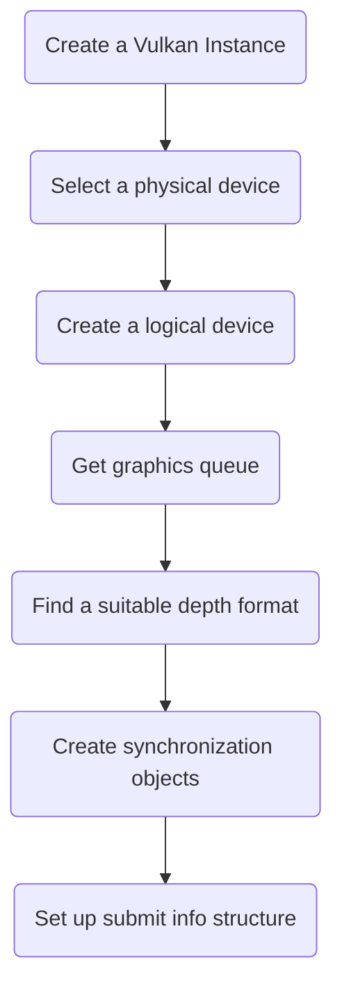

# VulkanExampleBase

- process args

# VulkanExampleBase::initVulkan

```mermaid
flowchart TD
    A1(Create a Vulkan Instance)-->A2(Select a physical device)
    A2-->A3(Create a logical device)
    A3-->A4(Get graphics queue)
    A4-->A5(Find a suitable depth format)
    A5-->A6(Create synchronization objects)
    A6-->A7(Set up submit info structure)
```