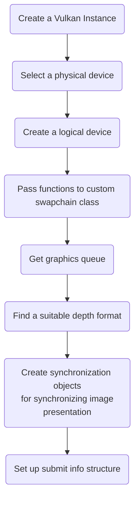
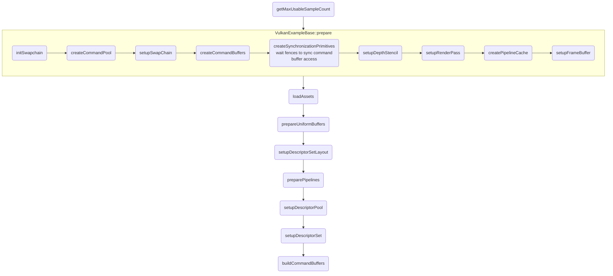
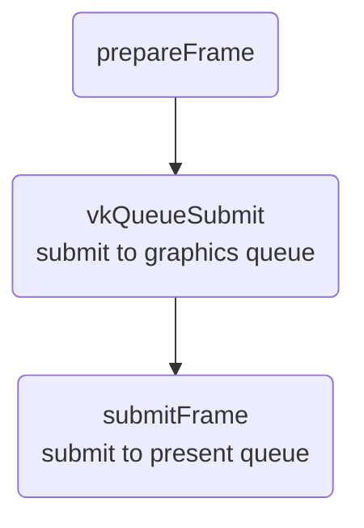

# 1 VulkanExampleBase()

- process args

# 2 VulkanExampleBase::initVulkan()

```mermaid
flowchart TD
    A1(Create a Vulkan Instance)-->A2(Select a physical device)
    A2-->A3(Create a logical device)-->A8(Pass functions to custom swapchain class)
    A8-->A4(Get graphics queue)
    A4-->A5(Find a suitable depth format)
    A5-->A6(Create synchronization objects\n for synchronizing image presentation)
    A6-->A7(Set up submit info structure)
```

# 3 VulkanExampleBase::setupWindow()

# 4 VulkanExample::prepare()

```mermaid
flowchart TD
    A1(getMaxUsableSampleCount)-->VulkanExampleBase::prepare
    subgraph VulkanExampleBase::prepare
            B1(initSwapchain)-->B2(createCommandPool)
            B2-->B3(setupSwapChain)
            B3-->B4(createCommandBuffers)
            B4-->B5(createSynchronizationPrimitives\n wait fences to sync command buffer access)
            B5-->B6(setupDepthStencil)
            B6-->B7(setupRenderPass)
            B7-->B8(createPipelineCache)
            B8-->B9(setupFrameBuffer)
    end
    VulkanExampleBase::prepare-->A2(loadAssets)
    A2-->A3(prepareUniformBuffers)
    A3-->A4(setupDescriptorSetLayout)
    A4-->A5(preparePipelines)
    A5-->A6(setupDescriptorPool)
    A6-->A7(setupDescriptorSet)
    A7-->A8(buildCommandBuffers)
```
# 5 VulkanExample::loop()

```mermaid
flowchart TD
    A1(prepareFrame)-->A2(vkQueueSubmit\n submit to graphics queue)
    A2-->A3(submitFrame\n submit to present queue)
```